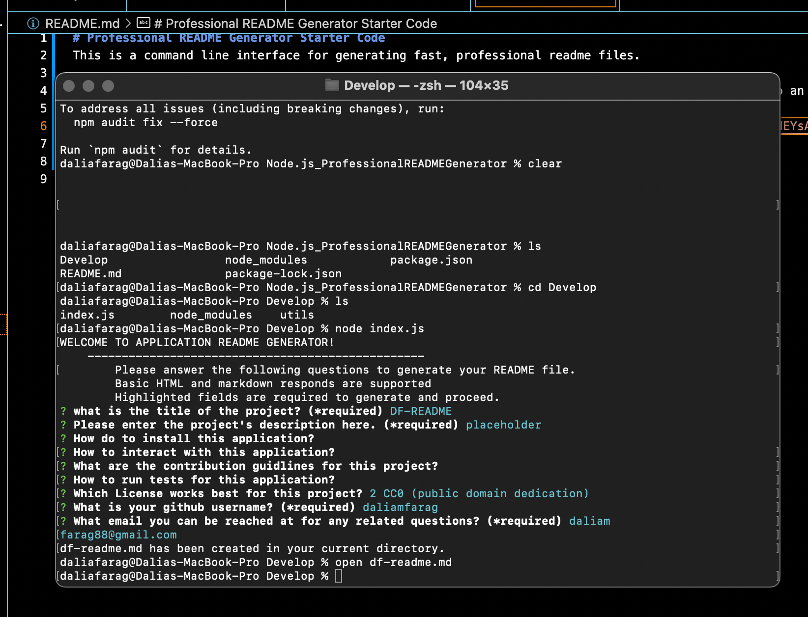

# Professional README Generator Starter Code
This is a command line interface for generating fast, professional readme files. 

This project was built with Inquirer, an npm package that allows you to ask a series of questions to an end user and respond to their answers accordingly. 

A walkthrough video for this project can be found <a href="https://watch.screencastify.com/v/TtEMAodEYsAg00D4M88Z">here</a>. Enjoy!

